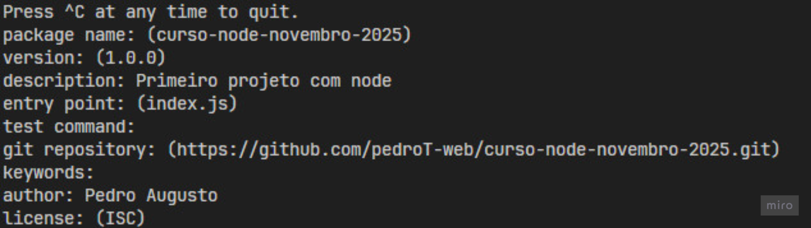
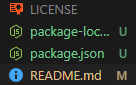

# 📦 Entendendo o package.json
Este documento explica o que é o arquivo `package.json` em um projeto Node.js, sua estrutura e função dentro do ecossistema do Node.


## O que é o package.json?

O package.json é um arquivo especial que todo projeto Node.js tem.
Ele serve como a identidade e o manual de instruções do projeto.

Pense nele como a ficha técnica do seu projeto JavaScript:

Ele diz o nome, a versão, quem fez, quais pacotes o projeto usa e como executá-lo.

## Para que ele serve?

O package.json tem várias funções importantes:

1. Descrever o projeto

Nome, versão, autor, descrição, licença etc.

2. Listar dependências

Mostra quais pacotes (bibliotecas) o projeto precisa.

Exemplo:
```js
"dependencies": {
  "express": "^4.18.2"
}
```
3. Definir scripts

Comandos que você pode rodar com npm run ....

Exemplo:
```js
"scripts": {
  "start": "node index.js"
}
```
Depois, você pode rodar no terminal:
```js
npm start
```

4. Facilitar o compartilhamento

Quem baixar seu projeto pode simplesmente rodar:

```js
npm install
```


E o Node vai baixar todas as dependências listadas no package.json.

## Estrutura básica

Um exemplo simples de package.json:

```js
{
  "name": "curso-node-novembro-2025",
  "version": "1.0.0",
  "description": "Primeiro projeto com node",
  "main": "index.js",
  "scripts": {
    "test": "echo \"Error: no test specified\" && exit 1"
  },
  "repository": {
    "type": "git",
    "url": "git+https://github.com/pedroT-web/curso-node-novembro-2025.git"
  },
  "author": "Pedro Augusto",
  "license": "ISC",
  "bugs": {
    "url": "https://github.com/pedroT-web/curso-node-novembro-2025/issues"
  },
  "homepage": "https://github.com/pedroT-web/curso-node-novembro-2025#readme"
}
```

## Como criar um package.json

Você pode criar o seu automaticamente no terminal:

```js
npm init 
```

<br>

Informações para criar o seu package.json


<br><br>

## Estrutura de um projeto quando iniciar o node


### LICENSE

- Contém a licença do projeto — ou seja, as regras de uso do código.

- Diz se outras pessoas podem copiar, modificar ou distribuir seu projeto.

- Exemplo comum: MIT, ISC, GPL, etc.

- É importante para projetos públicos (como no GitHub).
  
### package-lock.json

- Criado automaticamente pelo npm (quando você instala pacotes).

- Ele guarda a versão exata de cada dependência instalada.

- Serve para garantir que, se outra pessoa instalar o projeto,
as versões dos pacotes sejam idênticas às suas — evitando erros.

### Resumo rápido
- O `package.json` descreve seu projeto.
- Guarda scripts e dependências.
- Facilita a instalação e o compartilhamento.